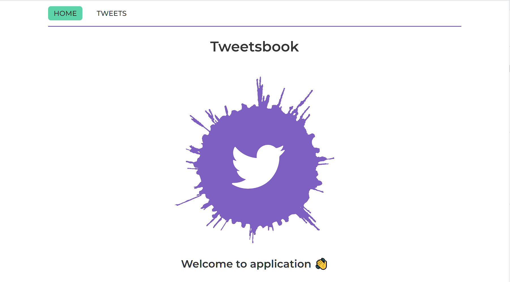
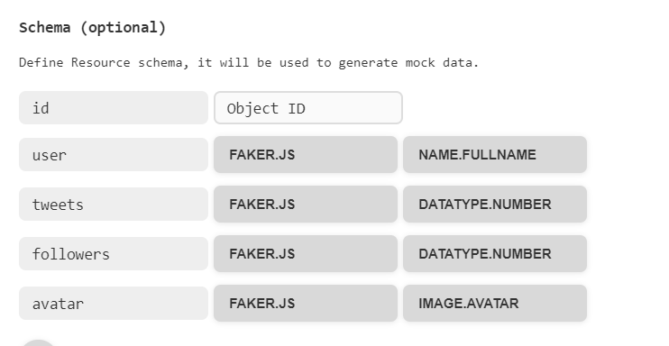

# Application - Tweetsbook

Whant to find users tweets and see how many followers does user have. So You
need to look at this application it helps to solve the problem. You can find
users? see general quantity of theirs tweets and followers. You can follow
specific user by yourself.

## Tweetsbook - Front-end

- [Link to site](https://sergiiternytskyi.github.io/test-tweets/)
- [Link to repository](https://github.com/SergiiTernytskyi/test-tweets)

This application saves Your time for finding tweets from users and providing the
possibility to follow them.

## Used technologies:

- HTML/CSS
- React
- Redux Toolkit
- Axios
- Styled Components

The app created using
[Create React App](https://github.com/facebook/create-react-app)

## Main functionality

- The App realised routes and two different pages. Home page wellcomes user and
  Tweets page shows cards with users tweets. In case of unexistent route, the
  redirection to the Home page take place.
- By clicking the Follow button, the name of the button changes to Following and
  the color of the button also changes. This changes the number of followers.
  Clicking the button again causes its text and color change to its original
  state.
- The app has user friendly filtration made in form of Dropdown with 3 options:
  show all, follow, followings.

## Installation and launch of the project

1. Clone the repository:
   `git clone https://github.com/SergiiTernytskyi/test-tweets`
2. Make sure you have an LTS version of Node.js installed on your computer.
   [Download and install](https://nodejs.org/en/) if needed.
3. Install the project's base dependencies with the `npm install` command.
4. Start development mode by running the `npm start` command.
5. Go to [http://localhost:3000](http://localhost:3000) in your browser. This
   page will automatically reload after saving changes to the project files.

## Tweetsbook - Back-end

- [Link to server](https://mockapi.io/projects/644aa956a8370fb3215512df/)
  

The back-end part of the app is built using capabilities of Mockapi. The users
includes user name, number of tweets, number of followers, URL of avatar.
